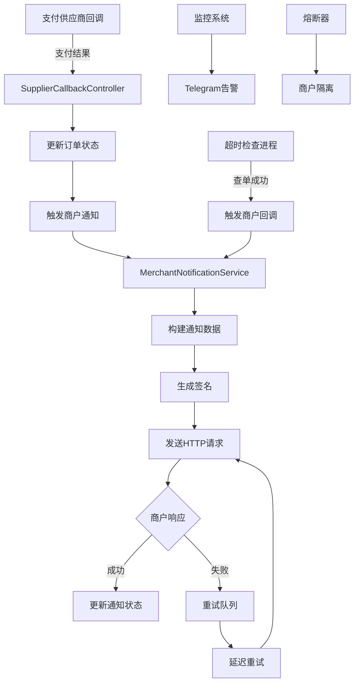
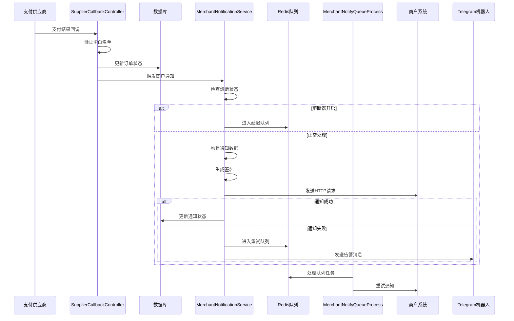
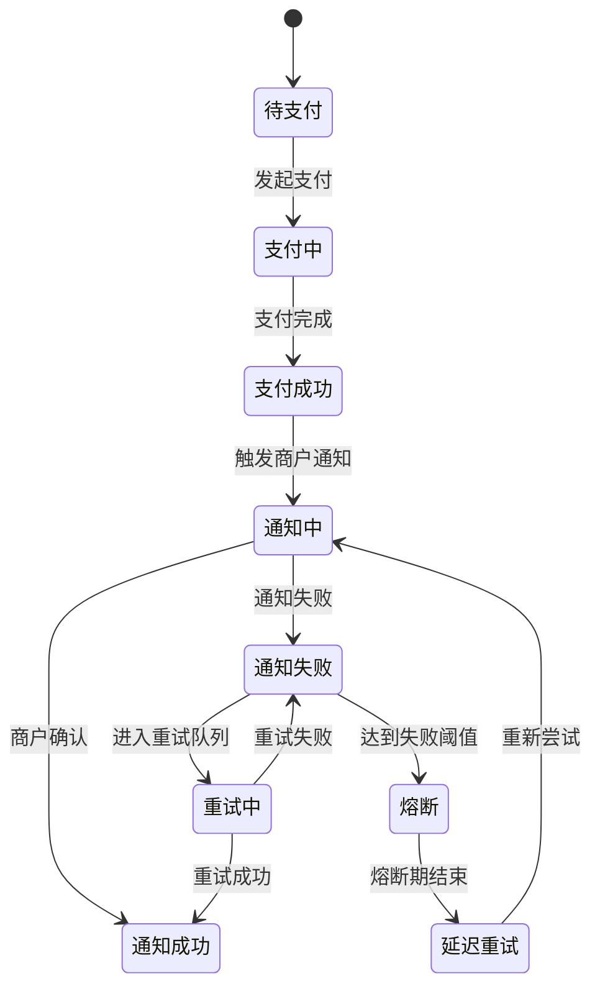

# 4Pay 回调商户机制分析文档

## 概述

本文档详细分析了4Pay支付系统的回调商户机制，包括触发机制、数据格式、签名验证、重试策略、监控告警等核心功能。

## 系统架构图



## 核心机制分析

### 1. 触发机制

#### 1.1 双重触发保障

**主要触发路径**：供应商回调触发
```php
// app/api/controller/v1/callback/SupplierCallbackController.php
private function updateOrderStatus(PaymentResult $result, string $paymentName): bool
{
    // 更新订单状态为支付成功
    $order->status = 3; // 3=支付成功
    $order->paid_time = date('Y-m-d H:i:s');
    $order->third_party_order_no = $result->getTransactionId();
    $order->notify_status = 0; // 重置通知状态
    $order->save();
    
    // 立即触发商户通知
    $this->triggerMerchantNotification($order, $paymentName);
}
```

**备用触发路径**：超时检查进程
```php
// app/process/OrderTimeoutCheckProcess.php
private function triggerMerchantCallback(int $orderId, string $orderNo, string $traceId): void
{
    // 使用商户通知服务触发回调
    $notificationService = new \app\service\notification\MerchantNotificationService();
    $notificationService->notifyMerchantAsync($order);
}
```

#### 1.2 触发条件检查

```php
// 检查是否有通知地址
if (empty($order->notify_url)) {
    return; // 跳过通知
}

// 检查是否已经通知成功
if ($order->notify_status == Order::NOTIFY_STATUS_SUCCESS) {
    return; // 避免重复通知
}
```

### 2. 数据格式与签名

#### 2.1 通知数据格式

```php
// app/service/notification/MerchantNotificationService.php
private function buildNotifyData(Order $order, array $callbackData = []): array
{
    return [
        'order_no' => $order->order_no,                    // 系统订单号
        'merchant_order_no' => $order->merchant_order_no,  // 商户订单号
        'third_party_order_no' => $order->third_party_order_no, // 第三方订单号
        'amount' => $order->amount,                        // 订单金额
        'status' => $order->status,                        // 订单状态
        'status_text' => $this->getStatusText($order->status), // 状态文本
        'paid_time' => $order->paid_time,                  // 支付时间
        'created_at' => $order->created_at,               // 创建时间
        'sign' => $this->generateSign($order),            // 签名
        'timestamp' => time(),                             // 时间戳
        'callback_data' => $callbackData                  // 回调数据
    ];
}
```

#### 2.2 签名生成机制

```php
// app/common/helpers/SignatureHelper.php
public static function generate(array $params, string $secretKey, array $signFields = [], string $algo = 'sha256'): string
{
    if(empty($signFields)) {
        ksort($params);
        foreach ($params as $k => $v) {
            if ($k === 'sign' || $k === 'client_ip' || $k === 'entities_id') continue;
            $signFields[] = $k;
        }
    }
    ksort($signFields);
    $stringToSign = '';
    foreach ($signFields as $field) {
        $stringToSign .= (string)($params[$field] ?? '');
    }
    return md5(hash_hmac($algo, $stringToSign, $secretKey));
}
```

**签名算法**：
1. 排除 `sign`、`client_ip`、`entities_id` 字段
2. 按字段名ASCII码排序
3. 拼接所有字段值
4. 使用HMAC-SHA256算法
5. 最后用MD5加密

#### 2.3 HTTP请求格式

```php
// 发送POST请求到商户通知地址
$response = $this->httpClient->post($order->notify_url, [
    'json' => $notifyData,
    'headers' => [
        'Content-Type' => 'application/json',
        'User-Agent' => 'PaymentSystem/1.0',
        'X-Order-No' => $order->order_no
    ]
]);
```

### 3. 高并发处理机制

#### 3.1 并发控制

```php
class MerchantNotificationService
{
    private $maxConcurrent = 50; // 最大并发数
    private $timeout = 10; // 请求超时时间
    private $retryTimes = 3; // 重试次数
    private $retryDelay = [1, 3, 5]; // 重试延迟（秒）
}
```

#### 3.2 批量处理

```php
public function batchNotifyMerchantsAsync(array $orders): void
{
    $promises = [];
    $notifyLogs = [];
    
    foreach ($orders as $order) {
        // 构建通知数据
        $notifyData = $this->buildNotifyData($order);
        $notifyLog = $this->createNotifyLog($order, $notifyData);
        
        // 创建异步请求
        $promises[$order->order_no] = $this->createAsyncRequest($order, $notifyData);
    }
    
    // 并发执行所有请求
    $responses = Promise\settle($promises)->wait();
    $this->handleBatchResponses($responses, $notifyLogs);
}
```

### 4. 重试机制

#### 4.1 智能重试策略

```php
private function scheduleRetry(Order $order, array $notifyData, NotifyLog $notifyLog): void
{
    if ($notifyLog->retry_count >= $this->retryTimes) {
        Log::warning('商户通知重试次数已达上限', [
            'order_no' => $order->order_no,
            'retry_count' => $notifyLog->retry_count
        ]);
        return;
    }

    $delay = $this->retryDelay[$notifyLog->retry_count] ?? 5;
    
    // 使用Redis延迟队列
    Redis::zAdd('merchant_notify_retry_queue', time() + $delay, json_encode([
        'order_id' => $order->id,
        'notify_data' => $notifyData,
        'retry_count' => $notifyLog->retry_count
    ]));
}
```

**重试策略**：
- 第1次重试：延迟1秒
- 第2次重试：延迟3秒  
- 第3次重试：延迟5秒
- 超过3次：停止重试

#### 4.2 队列处理

```php
// app/process/MerchantNotifyQueueProcess.php
// 处理重试队列 - 每10秒检查一次
new \Workerman\Crontab\Crontab('*/10 * * * * *', function(){
    $this->processRetryQueueWithStatus();
});
```

### 5. 防阻塞机制

#### 5.1 商户隔离

```php
// 慢商户识别
private $slowMerchantThreshold = 3; // 3秒阈值
private $maxFailureCount = 5; // 最大失败次数
private $circuitBreakerTimeout = 300; // 熔断器超时时间（5分钟）

// 熔断器状态检查
private function isMerchantCircuitBreakerOpen(string $notifyUrl): bool
{
    $key = 'merchant_circuit_breaker:' . md5($notifyUrl);
    $failureCount = Redis::get($key . ':failure_count') ?: 0;
    $lastFailureTime = Redis::get($key . ':last_failure_time') ?: 0;
    
    if ($failureCount >= $this->maxFailureCount) {
        $timeSinceLastFailure = time() - $lastFailureTime;
        if ($timeSinceLastFailure < $this->circuitBreakerTimeout) {
            return true; // 熔断器开启
        }
    }
    
    return false;
}
```

#### 5.2 延迟队列

```php
// 熔断商户进入延迟队列
if ($this->isMerchantCircuitBreakerOpen($order->notify_url)) {
    $this->scheduleDelayedNotification($order, $callbackData);
    return;
}
```

### 6. 监控与告警

#### 6.1 实时监控

```php
// 记录商户成功/失败
private function recordMerchantSuccess(string $notifyUrl, float $responseTime): void
{
    $key = 'merchant_stats:' . md5($notifyUrl);
    Redis::hIncrBy($key, 'success_count', 1);
    Redis::hSet($key, 'last_success_time', time());
    Redis::hSet($key, 'avg_response_time', $responseTime);
}

private function recordMerchantFailure(string $notifyUrl, float $responseTime): void
{
    $key = 'merchant_circuit_breaker:' . md5($notifyUrl);
    Redis::incr($key . ':failure_count');
    Redis::set($key . ':last_failure_time', time());
}
```

#### 6.2 Telegram告警

```php
// 发送熔断器告警
private function sendCircuitBreakerAlert(Order $order, NotifyLog $notifyLog): void
{
    $message = "🚨 商户通知熔断器告警\n\n" .
               "时间: " . date('Y-m-d H:i:s') . "\n" .
               "商户标识: " . md5($order->notify_url) . "\n" .
               "失败次数: " . $notifyLog->retry_count . "\n" .
               "熔断时长: 5分钟\n" .
               "状态: 熔断器已开启\n\n" .
               "影响: 该商户的通知将被暂停5分钟，避免影响其他商户的正常通知。";
    
    $this->telegramAlertService->sendAlert($message);
}
```

### 7. 数据流转过程

#### 7.1 完整回调流程



#### 7.2 状态流转图



### 8. 安全机制

#### 8.1 IP白名单验证

```php
// app/middleware/CallbackWhitelistMiddleware.php
public function process(Request $request, callable $next): Response
{
    $clientIp = $request->getRealIp();
    $allowedIps = $this->getAllowedIps();
    
    if (!in_array($clientIp, $allowedIps)) {
        Log::warning('回调IP不在白名单中', ['ip' => $clientIp]);
        return json(['code' => 403, 'msg' => 'IP not allowed']);
    }
    
    return $next($request);
}
```

#### 8.2 签名验证

```php
// 商户端验证签名
public static function verify(array $params, string $secretKey): bool
{
    if (!isset($params['sign'])) {
        return false;
    }

    $expectedSign = self::generate($params, $secretKey);
    return hash_equals($expectedSign, $params['sign']); // 防止时间攻击
}
```

### 9. 性能优化

#### 9.1 并发控制

```php
// 最大并发数配置
private $maxConcurrent = 50; // 可根据服务器性能调整
private $timeout = 10; // 请求超时时间
```

#### 9.2 批量处理

```php
// 批量通知提升效率
public function batchNotifyMerchantsAsync(array $orders): void
{
    // 并发执行多个通知请求
    $responses = Promise\settle($promises)->wait();
}
```

#### 9.3 Redis优化

```redis
# redis.conf 优化配置
maxmemory 2gb
maxmemory-policy allkeys-lru
tcp-keepalive 60
timeout 300
```

### 10. 故障排查

#### 10.1 常见问题

**问题1: 商户收不到通知**
- 检查商户通知地址是否正确
- 查看通知日志确认发送状态
- 检查商户服务器是否正常

**问题2: 通知重复发送**
- 检查订单通知状态
- 查看重试队列是否有重复任务
- 确认分布式锁是否正常工作

**问题3: 通知延迟**
- 检查Redis队列长度
- 查看商户响应时间
- 确认熔断器状态

#### 10.2 监控指标

**关键指标**：
- 通知成功率 - 目标 > 95%
- 平均响应时间 - 目标 < 3秒
- 重试率 - 目标 < 5%
- 熔断器触发次数 - 监控异常商户

**告警阈值**：
- 成功率 < 90% - 立即告警
- 平均响应时间 > 10秒 - 告警
- 重试率 > 10% - 告警
- 熔断器触发 > 5次/小时 - 告警

### 11. 最佳实践

#### 11.1 商户接入建议

1. **通知地址配置**
   - 使用HTTPS协议
   - 确保服务器稳定可靠
   - 配置负载均衡和故障转移

2. **签名验证**
   - 严格按照文档验证签名
   - 使用安全的密钥管理
   - 定期更新密钥

3. **响应格式**
   - 返回 `success` 表示接收成功
   - 其他响应表示接收失败
   - 响应时间控制在3秒内

#### 11.2 系统维护建议

1. **监控告警**
   - 配置Telegram机器人告警
   - 设置合理的告警阈值
   - 定期检查监控数据

2. **性能优化**
   - 根据业务量调整并发数
   - 定期清理过期日志
   - 监控Redis内存使用

3. **安全防护**
   - 定期更新IP白名单
   - 监控异常访问
   - 加强日志审计

## 总结

4Pay的回调商户机制采用了现代化的微服务架构设计，具有以下特点：

1. **高可靠性** - 双重触发保障，确保通知不丢失
2. **高性能** - 支持高并发处理，批量操作优化
3. **智能重试** - 递增延迟重试，避免系统压力
4. **防阻塞** - 商户隔离和熔断机制保护系统稳定
5. **可监控** - 完整的监控告警体系
6. **安全性** - IP白名单、签名验证等安全措施

该系统能够有效处理大量并发支付回调，确保商户及时收到支付结果通知，同时通过智能的防阻塞机制保护系统稳定性。
