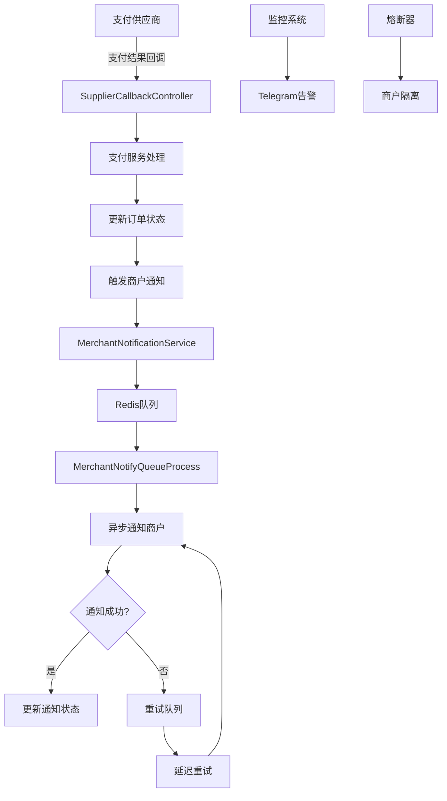
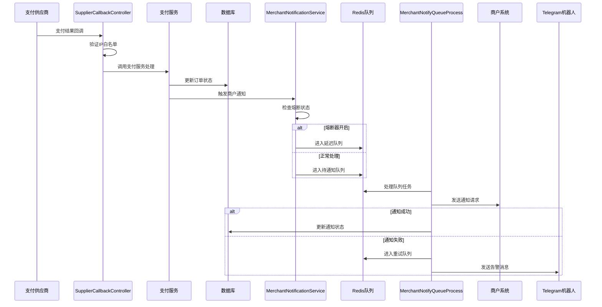
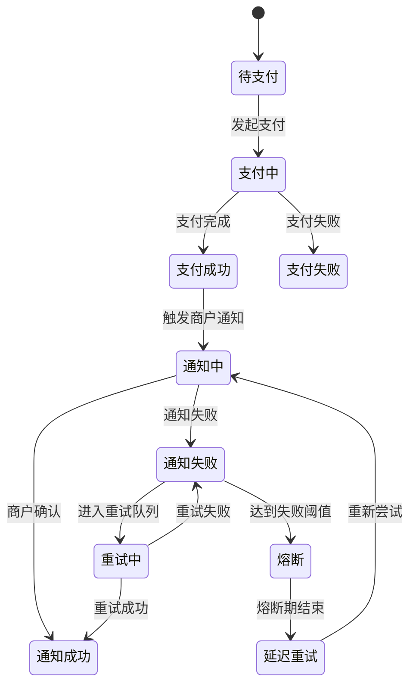

# 4Pay 异步回调流程分析文档

## 概述

本文档详细分析了4Pay支付系统的异步回调流程，包括供应商回调处理、商户通知机制、队列管理、重试策略等核心功能。

## 系统架构图



## 核心组件分析

### 1. 供应商回调处理

#### 1.1 回调路由配置
```php
// config/route.php
Route::group('/callback', function () {
    // 统一支付服务商回调路由
    Route::add(['GET', 'POST', 'OPTIONS'], '/{payment_name}', 
        [app\api\controller\v1\callback\SupplierCallbackController::class, 'handleCallback']);
})->middleware([app\middleware\CallbackWhitelistMiddleware::class]);
```

#### 1.2 回调控制器
**文件**: `app/api/controller/v1/callback/SupplierCallbackController.php`

**核心功能**:
- 接收不同支付服务商的通知回调
- 验证回调IP白名单
- 根据支付服务商名称动态调用对应服务
- 处理回调数据并更新订单状态

**处理流程**:
1. 验证供应商回调IP（中间件处理）
2. 获取回调数据（GET/POST参数）
3. 根据支付服务商名称获取对应服务实例
4. 调用服务处理回调
5. 更新订单状态
6. 触发商户通知

### 2. 商户通知系统

#### 2.1 通知服务核心
**文件**: `app/service/notification/MerchantNotificationService.php`

**技术特性**:
- ✅ **高并发处理** - 支持50个并发请求
- ✅ **异步队列** - 非阻塞式通知处理
- ✅ **智能重试** - 3次重试，递增延迟（1s, 3s, 5s）
- ✅ **分布式锁** - 防止重复通知
- ✅ **批量处理** - 批量通知提升效率
- ✅ **商户隔离** - 防止慢商户阻塞整个系统
- ✅ **熔断机制** - 自动熔断问题商户
- ✅ **延迟队列** - 熔断商户延迟重试
- ✅ **机器人告警** - 自动推送告警到Telegram机器人

#### 2.2 通知流程详解

```php
public function notifyMerchantAsync(Order $order, array $callbackData = []): void
{
    // 1. 检查是否已经通知成功
    if ($order->notify_status == Order::NOTIFY_STATUS_SUCCESS) {
        return;
    }
    
    // 2. 检查商户熔断状态
    if ($this->isMerchantCircuitBreakerOpen($order->notify_url)) {
        $this->scheduleDelayedNotification($order, $callbackData);
        return;
    }
    
    // 3. 创建通知数据
    $notifyData = $this->buildNotifyData($order, $callbackData);
    
    // 4. 记录通知日志
    $notifyLog = $this->createNotifyLog($order, $notifyData);
    
    // 5. 发送异步请求
    $this->sendAsyncRequest($order, $notifyData, $notifyLog);
}
```

#### 2.3 防阻塞机制

**商户隔离策略**:
```php
// 慢商户识别
private $slowMerchantThreshold = 3; // 3秒阈值
private $maxFailureCount = 5; // 最大失败次数
private $circuitBreakerTimeout = 300; // 熔断器超时时间（5分钟）

// 熔断器状态检查
private function isMerchantCircuitBreakerOpen(string $notifyUrl): bool
{
    $key = 'merchant_circuit_breaker:' . md5($notifyUrl);
    $failureCount = Redis::get($key . ':failure_count') ?: 0;
    $lastFailureTime = Redis::get($key . ':last_failure_time') ?: 0;
    
    // 检查是否达到熔断条件
    if ($failureCount >= $this->maxFailureCount) {
        $timeSinceLastFailure = time() - $lastFailureTime;
        if ($timeSinceLastFailure < $this->circuitBreakerTimeout) {
            return true; // 熔断器开启
        }
    }
    
    return false;
}
```

### 3. 队列管理系统

#### 3.1 队列进程配置
**文件**: `config/process.php`

```php
// 商户通知队列进程 - 完整版（处理新通知、重试、延迟）
'merchant_notify_queue' => [
    'handler' => app\process\MerchantNotifyQueueProcess::class,
    'reloadable' => false,
    'count' => 1,
    'constructor' => []
]
```

#### 3.2 队列处理进程
**文件**: `app/process/MerchantNotifyQueueProcess.php`

**处理任务**:
- **新通知队列** - 每100毫秒检查一次
- **重试队列** - 每10秒检查一次
- **延迟通知队列** - 每10秒检查一次
- **数据清理** - 每5分钟清理一次过期数据

**队列类型**:
1. `merchant_notify_pending_queue` - 待通知队列
2. `merchant_notify_retry_queue` - 重试队列
3. `merchant_notify_delayed_queue` - 延迟队列

#### 3.3 重试机制

**重试策略**:
```php
private $retryTimes = 3; // 重试次数
private $retryDelay = [1, 3, 5]; // 重试延迟（秒）

private function scheduleRetry(Order $order, array $notifyData, NotifyLog $notifyLog): void
{
    if ($notifyLog->retry_count >= $this->retryTimes) {
        Log::warning('商户通知重试次数已达上限', [
            'order_no' => $order->order_no,
            'retry_count' => $notifyLog->retry_count
        ]);
        return;
    }

    $delay = $this->retryDelay[$notifyLog->retry_count] ?? 5;
    
    // 使用Redis延迟队列
    Redis::zAdd('merchant_notify_retry_queue', time() + $delay, json_encode([
        'order_id' => $order->id,
        'notify_data' => $notifyData,
        'retry_count' => $notifyLog->retry_count
    ]));
}
```

### 4. 监控与告警系统

#### 4.1 监控接口
**路由**: `/api/v1/admin/merchant-callback-monitor/*`

**核心功能**:
- 实时数据监控
- 商户状态统计
- 通知日志查询
- 熔断器管理
- 健康状态检查

#### 4.2 Telegram机器人告警

**告警类型**:
1. **熔断器告警** - 商户熔断器开启时立即推送
2. **慢商户告警** - 响应时间超过阈值时推送（1小时内不重复）

**告警消息示例**:
```
🚨 商户通知熔断器告警

时间: 2025-01-10 15:30:45
商户标识: abc123def456
失败次数: 5
熔断时长: 5分钟
状态: 熔断器已开启

影响: 该商户的通知将被暂停5分钟，避免影响其他商户的正常通知。

建议: 请检查商户服务器状态和网络连接。
```

### 5. 数据流转过程

#### 5.1 完整回调流程



#### 5.2 状态流转图



### 6. 性能优化策略

#### 6.1 并发控制
```php
private $maxConcurrent = 50; // 最大并发数
private $timeout = 10; // 请求超时时间

// 批量处理
public function batchNotifyMerchantsAsync(array $orders): void
{
    $promises = [];
    $notifyLogs = [];
    
    foreach ($orders as $order) {
        $promise = $this->createAsyncRequest($order, $notifyData);
        $promises[$order->order_no] = $promise;
        $notifyLogs[$order->order_no] = $notifyLog;
    }
    
    // 并发执行
    $responses = Promise\settle($promises)->wait();
    $this->handleBatchResponses($responses, $notifyLogs);
}
```

#### 6.2 Redis配置优化
```redis
# redis.conf
maxmemory 2gb
maxmemory-policy allkeys-lru
tcp-keepalive 60
timeout 300
```

#### 6.3 PHP配置优化
```ini
; php.ini
memory_limit = 512M
max_execution_time = 0
max_input_time = -1
```

### 7. 故障排查指南

#### 7.1 常见问题

**问题1: 队列积压**
```bash
# 检查Redis队列长度
redis-cli
> LLEN merchant_notify_pending_queue
> ZCARD merchant_notify_retry_queue
> ZCARD merchant_notify_delayed_queue
```

**问题2: 通知失败率高**
- 检查商户服务器状态
- 查看网络连接
- 检查熔断器状态
- 查看错误日志

**问题3: 进程异常退出**
```bash
# 查看进程状态
ps aux | grep "merchant_notify_queue"

# 查看日志
tail -f runtime/logs/webman.log
```

#### 7.2 监控指标

**关键指标**:
- 队列长度 - 待处理通知数量
- 成功率 - 通知成功比例
- 平均响应时间 - 商户接口响应时间
- 重试率 - 需要重试的通知比例
- 错误率 - 通知失败比例

**告警阈值**:
- 队列长度 > 1000
- 成功率 < 95%
- 平均响应时间 > 10秒
- 错误率 > 5%

### 8. 部署配置

#### 8.1 进程配置
```php
// config/process.php
'merchant_notify_queue' => [
    'handler' => app\process\MerchantNotifyQueueProcess::class,
    'reloadable' => false,
    'count' => 1,
    'constructor' => []
]
```

#### 8.2 Supervisor配置
```ini
[program:merchant-notify-queue]
command=php /path/to/your/project/start.php
directory=/path/to/your/project
autostart=true
autorestart=true
user=www-data
redirect_stderr=true
stdout_logfile=/var/log/merchant-notify-queue.log
```

#### 8.3 系统服务配置
```ini
[Unit]
Description=Merchant Notify Queue Processor
After=network.target

[Service]
Type=simple
User=www-data
WorkingDirectory=/path/to/your/project
ExecStart=/usr/bin/php start.php
Restart=always
RestartSec=5

[Install]
WantedBy=multi-user.target
```

### 9. 安全考虑

#### 9.1 IP白名单验证
```php
// app/middleware/CallbackWhitelistMiddleware.php
public function process(Request $request, callable $next): Response
{
    $clientIp = $request->getRealIp();
    $allowedIps = $this->getAllowedIps();
    
    if (!in_array($clientIp, $allowedIps)) {
        Log::warning('回调IP不在白名单中', ['ip' => $clientIp]);
        return json(['code' => 403, 'msg' => 'IP not allowed']);
    }
    
    return $next($request);
}
```

#### 9.2 数据加密传输
- 使用HTTPS确保传输安全
- 敏感数据加密存储
- 签名验证确保数据完整性

### 10. 扩展功能

#### 10.1 支持多种通知方式
- HTTP回调
- WebSocket推送
- 消息队列（RabbitMQ/Kafka）
- 邮件通知
- 短信通知

#### 10.2 智能路由
- 根据商户配置选择通知方式
- 负载均衡多个通知地址
- 故障转移机制

#### 10.3 数据分析
- 通知成功率分析
- 商户响应时间分析
- 失败原因分析
- 趋势预测

## 总结

4Pay系统的异步回调流程采用了现代化的微服务架构设计，具有以下特点：

1. **高可用性** - 通过队列、重试、熔断机制确保系统稳定
2. **高性能** - 支持高并发处理，批量操作优化
3. **可监控** - 完整的监控告警体系
4. **可扩展** - 模块化设计，易于扩展新功能
5. **安全性** - IP白名单、数据加密等安全措施

该系统能够有效处理大量并发支付回调，确保商户及时收到支付结果通知，同时通过智能的防阻塞机制保护系统稳定性。

## 触发机制优化

### 问题分析
在原始设计中，供应商回调处理中存在一个关键问题：
- **供应商回调路径**：更新订单状态，但**不触发商户通知**
- **超时检查路径**：更新订单状态，**会触发商户通知**

这导致商户通知主要依赖超时检查进程，存在延迟和可靠性问题。

### 解决方案
已在 `SupplierCallbackController` 中添加直接触发商户通知的逻辑：

```php
// 在订单状态更新成功后
$order->save();

// 触发商户通知
$this->triggerMerchantNotification($order, $paymentName);

private function triggerMerchantNotification(\app\model\Order $order, string $paymentName): void
{
    // 检查通知地址和状态
    if (empty($order->notify_url) || $order->notify_status == Order::NOTIFY_STATUS_SUCCESS) {
        return;
    }
    
    // 使用商户通知服务触发回调
    $notificationService = new \app\service\notification\MerchantNotificationService();
    $notificationService->notifyMerchantAsync($order);
}
```

### 优化后的触发机制

| 触发路径 | 触发时机 | 是否触发商户通知 | 实时性 | 可靠性 |
|---------|---------|----------------|--------|--------|
| 供应商回调 | 支付完成时 | ✅ 是 | 实时 | 高 |
| 超时检查进程 | 定时检查时 | ✅ 是 | 延迟 | 备用 |
| 观察者模式 | 未使用 | - | - | - |

**改进效果**：
- ✅ **实时通知** - 支付成功后立即触发商户通知
- ✅ **双重保障** - 供应商回调 + 超时检查双重触发机制
- ✅ **提高可靠性** - 减少对单一进程的依赖
- ✅ **降低延迟** - 商户能更快收到支付结果通知
